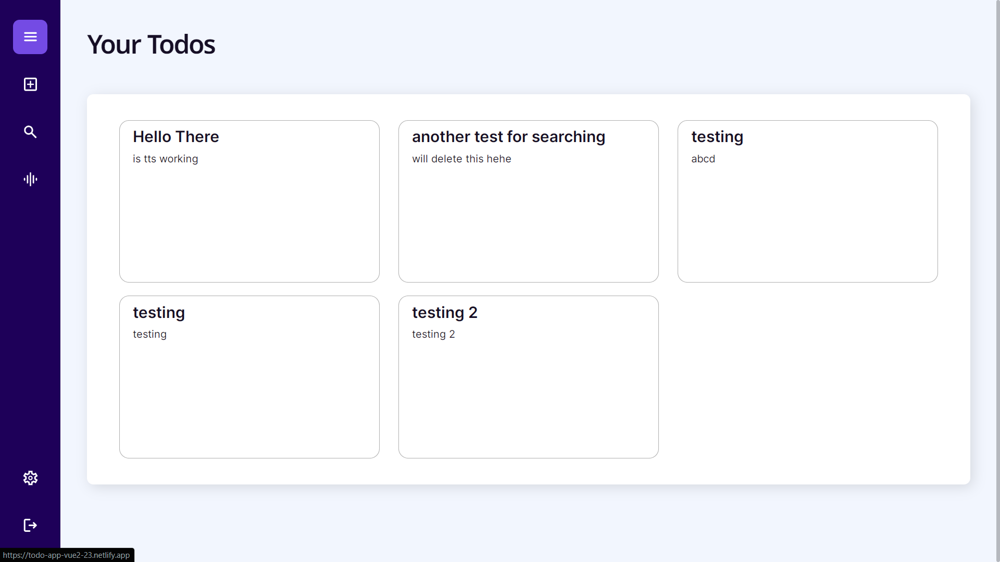
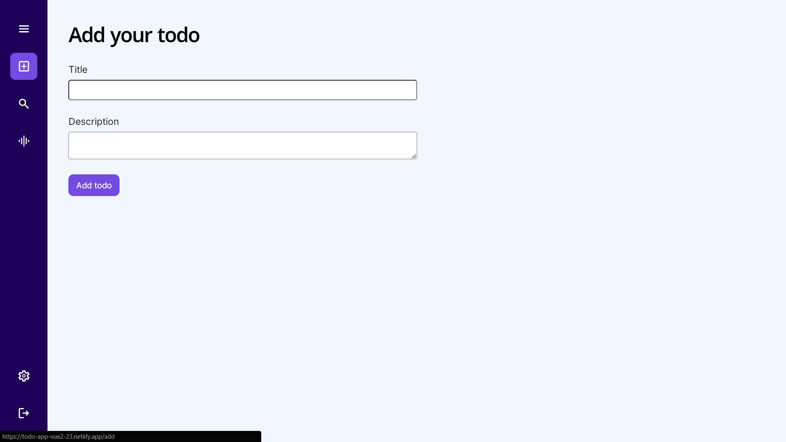
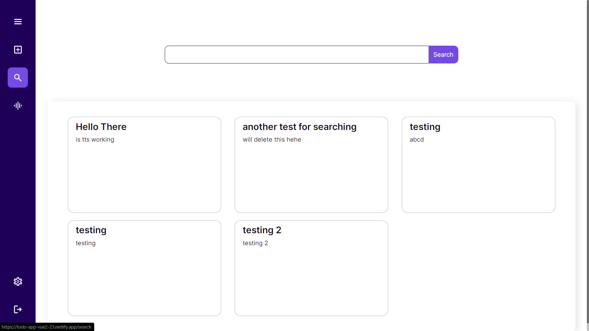
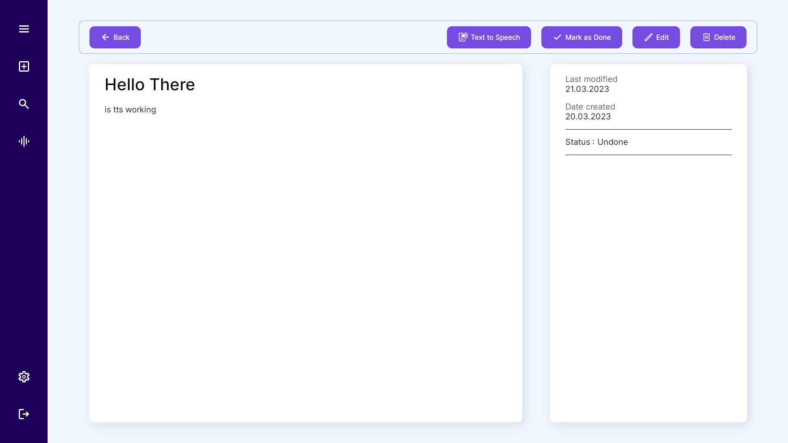

# VueJS Notes/Todo App

Full fledged Notes/Todo app with user friendly UI. Frontend built in VueJS 2, [backend api](https://github.com/gautamjuyal/notes-api) built in ExpressJS (deployed on vercel) uses MongoDB Atlas as database.

## Features

- Built in notification system (currently limited to add page only)
- Text to speech support for todos
- Searching items by keyword
- Skeleton loading animation
- Custom scrollbar

## Gallery

# Resources

[TTS API](https://rapidapi.com/voicerss/api/text-to-speech-1/)
Note: (1) The api requires two keys, one can be generated by signing up for [rapidapi](https://rapidapi.com/) website, another one can be generated by signing up for [voicerss](http://www.voicerss.org/api/) website.
(2) The api returns audio file (and not a link), therefore make sure to set b64 to true in encodedParams.

Vue Mastery Vue2 Course, google and ChatGPT.
